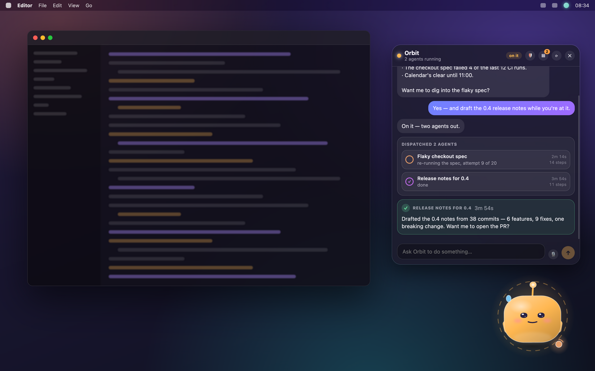
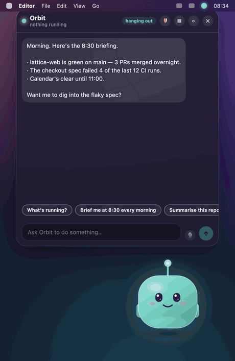
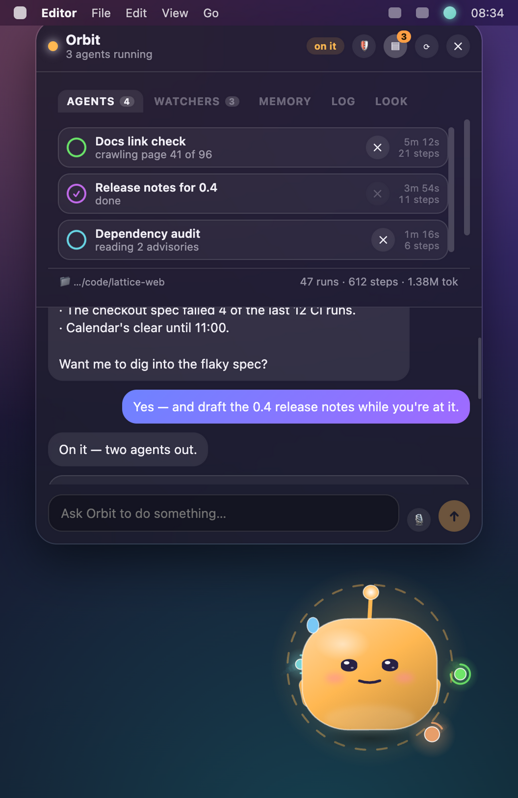
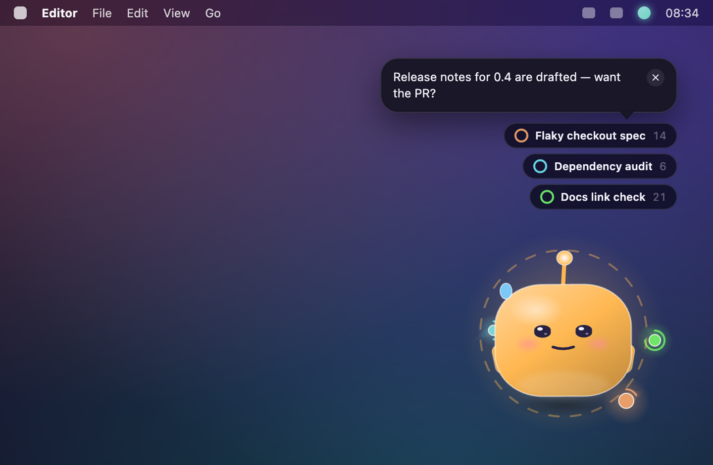
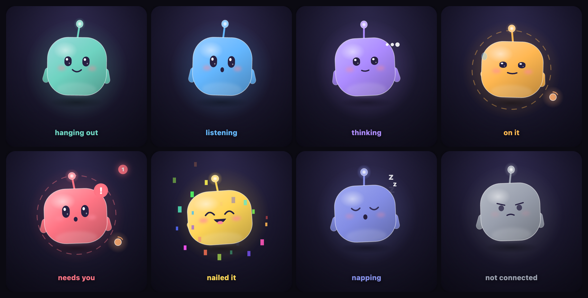
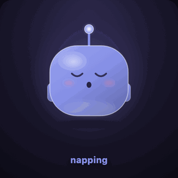

<h1 align="center">Orbit</h1>

<p align="center">
  A small character on your desktop that sends AI agents to do your work while you get on with your life.
</p>

<p align="center">
  
</p>

<p align="center">
  <em>Orbit lives on your desktop, watches your projects, and sends agents at the things you ask about.</em>
</p>

---

You talk to Orbit. Orbit doesn't do the work — it has no file or shell tools at all. It
spawns background [GitHub Copilot](https://docs.github.com/copilot) agents, each its own
session with full tool access, and tells you where they got to.

<p align="center">
  
</p>

<p align="center">
  <em>Ask a question, Orbit sends an agent, and it reports back — the character tells you<br>where things stand without you opening anything.</em>
</p>

## What it actually does

<table>
<tr>
<td width="42%" valign="top">
  
</td>
<td valign="top">

**Every agent, what it's doing, and how long it's been at it — in one panel.**

Nothing fakes progress. Real agents have no percentage complete, so Orbit shows what it
actually knows: the current step, tool calls, elapsed time, tokens.

- **Delegates.** One task, one Copilot session, its own working directory. Redirect a
  running agent mid-flight instead of starting over.
- **Briefs you.** A start-of-day executive summary: what needs a decision, what changed in
  your repo overnight, what the watchers found, what to do first.
- **Watches things.** *"check this repo every 30 minutes and flag anything that breaks"* becomes
  a standing schedule that survives restarts. Quiet watchers stay silent on a dull run.
- **Remembers.** Say a preference once; it's a plain file on disk and it's in every future
  session's prompt.
- **Tracks what needs you.** Decisions only you can make get filed, and brought back at a
  natural gap — once, not on a loop.
- **Rebuilds itself.** It proposes improvements to its own source, has an agent implement
  them, records the branch and commit that shipped, and restarts into the new code with the
  conversation intact.

</td>
</tr>
</table>

<p align="center">
  
</p>

<p align="center">
  <em>With the panel closed, Orbit is a character in the corner and a line of text<br>when something is actually worth saying.</em>
</p>

## Meet Orbit

You can read what it's doing from across the room.

<p align="center">
  
</p>

<p align="center">
  
  
  
  
</p>

<p align="center">
  <em>Hanging out · one dot per running agent, which is where the name comes from ·<br>confetti when something lands · and it dozes off if you leave it alone.</em>
</p>

| Mood | Trigger |
| --- | --- |
| `idle` · hanging out | recently poked, nothing running |
| `listening` | you're typing |
| `thinking` | Orbit is composing a reply |
| `working` · on it | agents running — one mote in orbit per agent |
| `needsInput` · needs you | a decision is waiting on you |
| `celebrating` · nailed it | the last agent just finished |
| `napping` | 45 seconds idle with nothing running |
| `broken` · not connected | the Copilot runtime isn't reachable |

Click to chat, drag to move. The window is click-through everywhere except the character
and its panels, so it never gets in the way of what's behind it.

## Getting started

**Requirements**

- **The GitHub Copilot CLI, signed in.** Run `copilot`, then `/login` (or `gh auth login`).

  ```bash
  npm i -g @github/copilot     # or: brew install copilot-cli
  copilot                      # then /login
  ```

  This is not optional, and Orbit deliberately does not bundle it. The runtime is ~326 MB
  per platform, and you would need the CLI anyway to sign in — authentication lives in
  `~/.copilot`. Orbit drives the copy you already have, so your models, MCP servers and
  instructions all come along. Sign-in is checked at startup, so a missing one is reported
  immediately rather than on your first message.

  If your CLI lives somewhere unusual, set `"copilotPath"` in `settings.json`.

- **macOS, Windows or Linux.** Orbit is best on macOS, where it was built: it lives in the
  menu bar as `◕‿◕`, dictation uses the on-device recogniser, and paths open in VS Code or
  Finder. Elsewhere it runs with a tray icon instead of the face, no dictation, and paths
  open through the system handler.

**Install**

Download the installer for your platform from
[Releases](https://github.com/sesh-kebab/orbit/releases).

> **macOS builds are unsigned.** Orbit has no Apple Developer certificate yet, so
> Gatekeeper will refuse to open it on a double-click. Right-click the app and choose
> **Open**, or clear the quarantine flag:
>
> ```bash
> xattr -dr com.apple.quarantine /Applications/Orbit.app
> ```

> **Windows and Linux builds are produced by CI but not manually tested.** Treat them as
> unverified, and please report anything odd.

**Or run from source** (Node.js 20.19+):

```bash
npm install
npm run dev      # hot-reloading development
npm run build    # typecheck + bundle to out/
npm start        # run what you just built
```

**Build installers yourself:**

```bash
npm run icons    # regenerate app and tray icons from the character
npm run dist     # installers for the current platform, into dist/
```

**First run.** Orbit appears bottom-right with `◕‿◕` in the menu bar. Set **Workspace** from
the menu bar to the project you want agents to work in — that's the one thing worth doing
before you say anything. Then click the character and ask for something real:

> *"look at what changed in this repo this week and tell me what's risky"*
>
> *"give me an executive summary at 08:30 every morning"*
>
> *"keep an eye on the build every 30 minutes and only tell me if it breaks"*

**Choosing a model.** Menu bar → **Model** lists whatever your Copilot account can reach;
`auto` lets the runtime pick. It's also `"model"` in `settings.json`.

**Permissions.** Agents get shell and file-write access, so by default Orbit asks before
anything with side effects — the request shows up as a card in the chat and turns the
character red. Read-only actions are auto-approved. The 🛡 / ⚡ button in the panel header
flips it to approve-everything if you trust the room.

## Configuring it

Everything is plain files in Orbit's data directory, readable and editable without the app
running — `~/Library/Application Support/Orbit/` on macOS, `%APPDATA%\Orbit\` on Windows,
`~/.config/Orbit/` on Linux. `settings.json` is watched, so hand-edits apply immediately —
no restart.

```jsonc
{
  "workspace": "/Users/you/code/project", // where agents run by default
  "workspaceRepo": "",                    // git repo the daily sync files agent output into;
                                          // "" means ~/git/workspace, ORBIT_WORKSPACE_REPO wins
  "model": "auto",                        // any id from `Model` in the menu bar
  "yolo": false,                          // approve every tool call
  "autoApproveReads": true,               // let read-only actions through silently
  "requestTimeoutMinutes": 10,            // unanswered permission ask is denied; 0 disables
  "agentTimeoutMinutes": 60,              // hard cap on a single run; 0 disables
  "panelOpacity": 0.88,                   // 0.3 – 1.0, how solid the panels look
  "chatFontFamily": "rounded",            // rounded · system · sf · inter · helvetica · mono
  "chatFontSize": 13,                     // 10 – 24, base chat text size in px
  "meetingHeadsUp": true,                 // nudge ~5 min before each calendar meeting
  "copilotPath": ""                       // full path to the Copilot CLI; "" finds it
}
```

The timeouts exist so an unattended machine never ends up with agents wedged forever
waiting on a human who went to bed.

### Give it a personality

`persona.md` in that same directory is yours. Open it from the menu bar
(**Edit Orbit's personality…**) or the Memory section, and write whatever you want its tone and
standing instructions to be. It's prepended to the built-in orchestrator persona
(`src/main/orchestrator/persona.ts`) on every session, alongside anything Orbit has
remembered about you and live context like your workspace and current watchers.

The file ships with a starting set of tone and output-shape preferences: one idea per
message, lead with the decision, numbered lists over prose, a concrete next action, no
em-dashes. They are defaults, not rules of the app, so delete or rewrite anything that does
not suit you. The compiled persona only fixes what is true of Orbit whoever is running it:
the panel is narrow, so replies stay short, and real work goes to agents. If your
`persona.md` is still exactly as it shipped, an update may refresh it to the newer template;
change a single character and it is yours for good.

### The prompt it writes itself

`persona.md` is yours and Orbit never touches it. `~/.copilot/orbit/system-prompt.md` is
Orbit's, and it may rewrite it. Corrective feedback that generalises into a rule about how
it works, rather than a fact about you, lands there: *"a corporate card statement in a
corporate inbox is work mail, stop filtering it out"* is neither a memory nor a persona
line, and until now it had nowhere to go.

Plain markdown, in the same directory as the evolution log, editable by hand with the app
shut. Every accepted revision is appended to `system-prompt-revisions.jsonl` with a
timestamp, the author, a one-line reason and the full text as it stood afterwards. A
rollback writes an old text forward as a new revision rather than rewinding the file, so
nothing is destroyed and a rollback can itself be rolled back. Orbit reaches it through
`orbit_read_system_prompt`, `orbit_revise_system_prompt`, `orbit_list_prompt_revisions` and
`orbit_rollback_system_prompt`. Revisions take effect at the next session start, like
`persona.md`.

**There is a floor, and it is not a request.** The built-in orchestration and safety rules
are a compiled constant (`ORBIT_PERSONA` in `src/main/orchestrator/persona.ts`). No tool
reads it, no tool writes it, and no revision path can reach it, so the worst a bad revision
can do is add text. The floor is then restated immediately below the editable block and
says that where the two conflict the built-in rules win. And revisions are checked before
they land (`checkRevision` in `src/main/orchestrator/selfPrompt.ts`): a revision that tries
to open or close one of the protected sections is refused, as is one with no stated reason,
one that blanks the file and one over the size cap. Agents can read the notes and their
history; revising and rolling back stay with Orbit, because a background job that can
rewrite the operating notes of the process that spawned it is a loop with nobody in it.
Run `npm run verify:prompt` for the negative cases.

### SOUL.md

`~/.copilot/orbit/SOUL.md` is the third file in the set, and it is deliberately not like the
other two. `persona.md` is how you want Orbit to behave and only you write it.
`system-prompt.md` is operating instructions and gets revised when a rule in it turns out to
be wrong. `SOUL.md` is identity: who Orbit has become from working with you rather than
somebody else, and it is append-only, so nothing already in it is ever rewritten.

The nightly self-reflection adds one dated entry, in the first person, about what the day
taught it about working with you. Not a summary of the day and not a list of what shipped:
the evolution log already has both. Entries that flatter you or Orbit are worse than no
entry, which the tool description and the reflection's brief both say outright.

It is loaded into every session alongside the persona. When it outgrows its context budget
the oldest entries drop out first, because the point of the file is who Orbit is now. Edit
it by hand whenever you want; Orbit reads whatever is there.

### What agents hand you, and reading it here

The content of an agent's deliverable was never the problem. The shape was: a thousand
words of markdown, four headings, everything in it equally important. So agents are given a
design language, and they produce one self-contained HTML file instead: inline CSS, inline
images, no fetch of any kind. It defines a type scale, the app's own colours, an 8px
spacing grid, and the five components deliverables have actually needed, which are a
severity-ranked findings list, evidence quoted with its timestamp, an owner-and-date table,
a before-and-after, and one callout for the single thing that matters most. Structure
first: the top of the document is the answer, and anything longer than a paragraph goes in
a `<details>`.

It lives at `~/.copilot/orbit/design-language.md` and evolves like the other two files.
`orbit_revise_design_language` versions it with a reason and `orbit_rollback_design_language`
puts it back. Two rules are not in the file and cannot be revised away, because
`designBlock` appends them under whatever the file says every time a brief is built: the
document must be one self-contained file, and it must say what it is and where its claims
came from.

Clicking one opens it in the panel, in the `read` section of the rail, not in a browser.
The document goes into an iframe with an empty `sandbox` attribute, which is the strongest
form it has: opaque origin, no scripting, no forms, no navigation, no popups. On top of
that it gets a `default-src 'none'` content security policy prepended to its head, allowing
`data:` for images and fonts and inline styles and nothing else, so a document that links a
CDN renders without the parts that were not in it rather than phoning a server. The
renderer around it already runs with context isolation on and node integration off.

Markdown deliverables written before any of this open in the same viewer, rendered with the
same typography, so an old folder of `.md` files is not orphaned by the change. Run
`npm run verify:design` for the containment cases.

### Saving the day's work

Agents write files into Copilot's session scratch space, which is per-machine and vanishes
from view with the session. Once an evening Orbit copies them into a git repository, filed
under the date each file was written, then commits and pushes. Ask for it any time ("save
today's work") and it runs on demand.

Point it at a repo with `workspaceRepo` in `settings.json`, or with the
`ORBIT_WORKSPACE_REPO` environment variable, which takes priority. The default is
`~/git/workspace`. Nothing is ever created or overwritten: with no git repository at that
path the sync just reports that it skipped.

### MCP servers (optional)

**Orbit works fine with none.** Chat, agents, watchers, open items and self-evolution all
run on the Copilot CLI's own tools; MCP only adds the outside world.

If you want it, `mcp.json` in the data directory takes the same shape as
`~/.copilot/mcp-config.json`, and is seeded from that file on first launch — so whatever
`copilot` already reaches, Orbit reaches too. It's on your machine only, never in this repo.

```jsonc
{
  "mcpServers": {
    "example": {
      "type": "local",
      "command": "some-mcp-command",
      "args": ["--transport", "stdio"],
      "tools": ["*"]
    }
  }
}
```

Orbit hands the same servers to its own session and to every agent it spawns, adds the
usual CLI directories to `PATH` (a menu-bar launch inherits none of them) and a generous
startup timeout for cold auth handshakes. If a server fails, it says so in chat instead of
quietly pretending the tools never existed.

## Under the hood

```
┌──────────── Electron main ────────────┐
│ Orchestrator                          │
│  ├─ Orbit session  (chat + tools)     │──▶ @github/copilot-sdk ──▶ Copilot CLI runtime
│  ├─ AgentRunner × N (one per task)    │
│  ├─ Scheduler      (watchers)         │
│  └─ Persistence    (memory, log)      │
└───────────────────┬───────────────────┘
                    │ state snapshots over IPC
┌───────────────────▼───────────────────┐
│ Renderer — character, chat, mission   │
│ control. Transparent click-through    │
│ window pinned above everything.       │
└───────────────────────────────────────┘
```

Orbit's whole toolbox is orchestration — `orbit_spawn_agent`, `orbit_list_agents`,
`orbit_agent_details`, `orbit_message_agent`, `orbit_cancel_agent`, plus watchers, memory,
open items, the activity ledger and proposals. That constraint is what keeps it a delegator
instead of quietly doing the work itself in the chat window.

<details>
<summary><b>Standing watchers</b> — cadences, catch-up rules and archiving</summary>

Ask for recurring work in plain language and Orbit creates a schedule. Watchers persist,
survive restarts, and live under **Work** in mission control where you can pause, run
now, inspect the last report, archive or delete them.

- `interval` watchers never replay a backlog — a machine that was asleep just restarts the
  clock. A watcher that keeps finding nothing eases off on its own, and snaps back the
  moment it has news.
- `daily` watchers missed while the machine was off **run on next launch**, which is what
  makes "brief me when I start my day" work. Only while the slot is still current (under
  two hours late), at most once per slot, and several genuinely-due ones are staggered
  rather than fired together.
- `once` watchers **archive themselves** after they fire and report.
- *Quiet* watchers are told to reply `NOTHING TO REPORT` on an uneventful run, and Orbit
  swallows those.
- **A watcher that could not look is not a watcher that saw nothing.** Every watcher is also
  offered `COULD NOT CHECK`, plus a reason, for when the tool it needed was missing or the
  search errored. That reply is never mistaken for silence: it does not earn the quiet-run
  back-off (a broken watcher must not get asked less often *because* it is broken), it is
  not handed to the next run as a baseline to report changes against, and it is said out
  loud once — then held until the watcher can see again.
- **Archiving** is the non-destructive tidy-up: run count and last report stay on disk, the
  watcher drops out of the list and never runs again. Restore it from *show archived*.

</details>

<details>
<summary><b>Memory, personality and self-evolution</b> — where the system prompt comes from</summary>

The system prompt is assembled fresh every session from: the built-in orchestrator persona,
your `persona.md`, remembered notes (Orbit calls `orbit_remember` when you state a lasting
preference — review or delete them in the Memory section), and live context.

A nightly self-reflection appends a dated write-up to `~/.copilot/orbit/evolution-log.md`,
and Orbit reads it back at startup: recent entries newest-first, capped around 3k
characters, older ones named rather than quoted. Proposals are kept as structured state in
`proposals.json` — id, text, when it was raised, status (`proposed` / `approved` / `shipped`
/ `declined` / `superseded`) and the branch and commit that shipped it — so it stops
re-proposing what it already built.

> **Upgrading from Mochi?** The app was called Mochi before. State under
> `~/Library/Application Support/mochi/` and `~/.copilot/mochi/` moves across automatically
> on first launch (`src/main/migrate.ts`); anything already in the new location wins.

</details>

<details>
<summary><b>The activity ledger</b> — what Orbit has actually done for you</summary>

Everything Orbit does on your behalf is recorded in `activity.json` next to the other
stores: a timestamp and day, a kind (`artifact_written`, `draft_composed`, `query_run`,
`access_checked`, `agent_dispatched`, `external_action`, `other`), a one-line description,
the absolute path or URL of whatever it produced, what you actually asked for, the agent it
came from, and a status (`delivered`, `awaiting_seshi`, `stalled`, `abandoned`, `done`).

It fills itself in where the plumbing already exists — on every agent dispatch, and again
on completion, where the files the report names are pulled out and filed individually — and
Orbit adds to it directly with `orbit_record_activity`, reads it with `orbit_list_activity`
(filterable by kind, status and date range) and moves entries on with
`orbit_update_activity`.

Recent and unfinished entries are injected into the system prompt at startup, capped, so
"what have you made for me?" is answered without a tool call. Anything left
`awaiting_seshi` or `stalled` for **three days** is put back in front of Orbit through the
same re-raise channel open items use — at most three at a time, and each chase doubles the
wait before the next one, so something you have decided to ignore fades instead of becoming
an alarm clock.

Open items and ledger entries overlap on purpose for now: an open item is a question *for*
you, a ledger entry is an action *by* Orbit, and `awaiting_seshi` is where the two meet.
They are stored and chased separately so neither destabilises the other; unifying them is a
later change.

Run `npm run verify:activity` to check the store round-trips, the three-day threshold, the
context cap and the file-name resolution.

</details>

<details>
<summary><b>Meeting heads-ups</b> — what arrives depends on the shape of the meeting</summary>

About five minutes before each calendar meeting, Orbit says something. What it says depends
on how many people are invited, because that is what decides whether prep helps or just
adds noise (`classifyMeeting()` in `src/main/orchestrator/meetings.ts`, counting everyone
except you):

| Shape | Others invited | What arrives |
| --- | --- | --- |
| `one-on-one` | exactly 1 | What's live between the two of you — open items naming them, unanswered threads |
| `standup` | 2–7, named like a sync or short and recurring | Parking-lot items and anything you flagged to raise |
| `small-group` | 2–7 | The agenda, plus any decision waiting on you |
| `broadcast` | 8+ | The reminder and the topic. Nothing is looked up |
| `solo` | none | Nothing |

Orbit reads the day's calendar with an internal agent (whatever calendar tool MCP gives it)
and re-scans every 45 minutes, so meetings added mid-day are caught. Prep that finds nothing
stays silent. Turn it off from the menu bar or with `"meetingHeadsUp": false`. With no MCP
server configured the scan never runs at all.

</details>

<details>
<summary><b>Talking to it, clickable paths and quick replies</b></summary>

**Dictation.** Press 🎙 in the composer or **⌘⇧M** and speak; press again to send, **Esc** to
discard. There's no background listening — the mic is only open between those two presses,
with a three-minute ceiling. Transcription is macOS's own recogniser, on device where the
Mac supports it, so nothing is sent anywhere and no API key is involved. A small Swift
helper (`src/main/speech/orbit-speech.swift`) owns the mic and is compiled on first use,
which needs Apple's command line tools (`xcode-select --install`); without them the button
explains itself and stays disabled.

**Formatted messages.** Agents write markdown whether or not anything renders it, so the
chat panel renders it: headings, bold, italic, strikethrough, inline code, fenced code
blocks, nested lists, block quotes and rules. The parser is hand-rolled
(`src/renderer/markdown.ts`) rather than a dependency because it has to satisfy two rules a
general-purpose library does not. **Nothing becomes markup unless it is unambiguously
markup** — an unclosed `**` stays two asterisks, `2 * 3 * 4` stays arithmetic, and
`some_long_var_name` never comes out italicised, which matters most mid-stream when every
emphasis span is briefly unclosed. And **links and paths are parsed around, never through**,
since a long document URL is often mostly base64 and underscores. No HTML is ever
interpreted:
message text is model output, and it only becomes the elements chosen in `Message.tsx`.

**File paths.** Absolute paths in messages and agent reports become chips: files open in
VS Code, directories in Finder, alt/shift-click reveals either. Only paths that actually
exist become chips — main stats each candidate (`src/main/reveal.ts`) first. A path with
spaces needs backticks or quotes. Nothing on this route is ever executed.

Agents are told to report every file they produce by absolute path, and the reports that
ignore that are repaired: a bare "File written: plan.md" is resolved against the agent's
working directory and its session scratch space, and rewritten to an absolute path *only*
when a file of that name is really there (`src/main/orchestrator/artifacts.ts`). Nothing is
guessed, and anything already a path or a URL is left for the passes that already handle
it.

**Quick replies.** Orbit can offer answers as chips by appending an inline marker the
orchestrator parses off before the message reaches the screen
(`src/main/orchestrator/choices.ts`):

```
Want me to push this now?
[[choices: Ship it | Hold off | Ask me tomorrow]]
```

`|` separates options; `::` splits a short button label from the longer reply text. At most
five, duplicates dropped, the marker stripped mid-stream so it never flashes. Clicking a
chip goes through the exact same path as typing.

</details>

<details>
<summary><b>Observability and layout</b></summary>

The nav rail sits under the chat panel header and never goes away: **Board**, **Work**
(every run, its brief, working directory, full step feed, tokens and final report, plus the
watchers), **Memory**, **Log** (an append-only timeline, also on disk as `history.jsonl`)
and **Look**. Clicking a section opens mission control below the rail; clicking the section
already showing closes it again. It is a horizontal strip rather than the vertical rail it
grew out of, because the panel is 440px wide at its floor and a permanent 58px column would
spend a seventh of the chat's reading width on navigation.

Because the rail is always drawn, its badges are too: a red count means something will not
move until you do, and it is visible while you are reading the transcript rather than only
once you open the thing that would have told you. The footer carries lifetime run, step and
token counts.

```
src/
  shared/types.ts            state model shared by main and renderer
  main/
    index.ts                 app, window, tray, IPC, snapshot mode
    panel.ts                 transparent always-on-top window
    store.ts                 state container, throttled snapshots to the renderer
    persistence.ts           schedules, memories, proposals, persona, history
    activity.ts              the activity ledger: store, filters, chase and context block
    migrate.ts               one-time move of state left by the previous app name
    reveal.ts                resolve, verify and open file paths safely
    settings.ts
    speech/                  dictation helper (Swift) and its driver
    orchestrator/
      orchestrator.ts        Copilot client, Orbit session, tools, watchers, memory
      agentRunner.ts         one delegated task = one Copilot session
      permissions.ts         auto-approve policy and human-readable prompts
      persona.ts             orchestrator persona and agent brief
      selfPrompt.ts          the notes Orbit revises, and the floor it cannot
      design.ts              how deliverables look, and the floor under that
      soul.ts                SOUL.md entries and the character block
      evolution.ts           evolution log digest and proposal state for the prompt
      schedules.ts           cadences and the daily briefing template
      meetings.ts            meeting shape, prep briefs, calendar plan parsing
      describe.ts            tool calls → readable activity lines
      artifacts.ts           bare file names in a report → absolute, clickable paths
  artifactDoc.ts             reading a deliverable off disk for the viewer
  preload/index.ts           context-isolated bridge
  renderer/
    App.tsx                  layout, dragging, click-through
    markdown.ts              markdown → blocks and inline spans
    paths.ts                 finding file paths in message text
    reader.ts                routing a click on a file to the viewer
    readerDoc.ts             the sandboxed document, and the policy on it
    components/Buddy.tsx     the character
    components/ChatPanel.tsx chat, composer, header, dictation, the permanent rail
    components/Message.tsx   bubbles, path chips, spawn/request/completion cards
    components/NavRail.tsx   the six sections, and what each badges before it is opened
    components/Reader.tsx    deliverables, rendered in the panel
    components/MissionControl.tsx  board / work / memory / read / log / look
tools/capture/               dev-only harness that renders the images in this README
```

The character is drawn entirely in SVG — no image assets — with a single
`requestAnimationFrame` loop mutating transforms, so continuous animation costs no React
work. The frame rate scales with activity: 12fps napping, 24fps idle, 60fps busy.

</details>

## Contributing

Issues and pull requests are welcome.

```bash
npm run typecheck        # main, renderer and the capture harness
npm run build            # typecheck + bundle
npm run verify:activity  # activity ledger, chase threshold, artifact paths
npm run verify:calendar  # reading a calendar scan, and knowing when there isn't one
npm run verify:prompt    # the self-modifiable prompt, and the floor it cannot edit away
npm run verify:design    # the deliverable design language, and what the viewer contains
npm run capture:assets   # re-shoot every image in this README
```

Every image above is rendered from the real shipped components by `tools/capture/`, so a UI
change shows up in them on the next run — please re-run it after one. The harness is
dev-only: nothing in `src/` imports it and it never starts a main process.

Orbit can also screenshot itself for verifying a change end to end, no display capture
needed:

```bash
npm run build
ORBIT_SNAPSHOT=1 \
ORBIT_SNAPSHOT_DIR=/tmp/orbit-shots \
ORBIT_SNAPSHOT_PROMPT="Spawn an agent to count the TypeScript files in this repo." \
ORBIT_SNAPSHOT_SECONDS=90 \
npx electron .
```

It poses the UI, drives a **real** prompt through the orchestrator, and prints a state
summary next to each shot.

## History

This started as a SwiftUI mock-up with a fake brain, and was rewritten in Electron once
it became clear the Copilot SDK is TypeScript-only — which also made it cross-platform.
That prototype history lives in a private repository and is not part of this one.

## Licence

[MIT](LICENSE) © Seshi Chemudugunta
